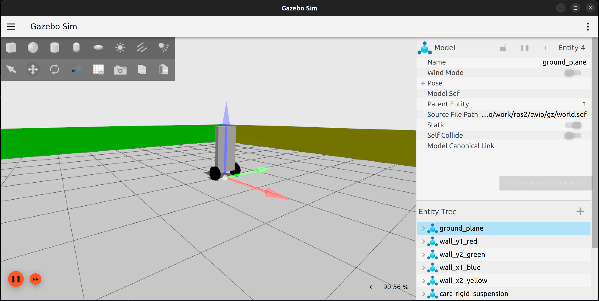

# twip - Two Wheeled Inverted Pendulum




## Introduction

This is an attempt at implementing a PID controller for a Two Wheeled Inverted Pendulum (a.k.a. Segway). Traditional approaches to this problem have relied on control engineering approaches of modeling the robot (i.e. the plant) and then designing the feedback controller using pole-zero analysis. 

With the availability of environments like Gazebo Sim, solving the PID gain parameters by simulating the robot with a range of parameters becomes a simple approach to solving a complicated problem.

## Building

### Install prerequisites

* cmake
* Gazebo sim
* gz-transport
* gz-msgs
* SQLite3

### Build

```
git clone https://github.com/devonho/twip.git
cd twip
mkdir build
cd build
cmake ../
```

## Running 

### Start Gazebo
```
cd ./twip/gz
gz sim world.sdf -r
```
Add `Key Publisher` via the plugin menu.

### Start controller  
```
./twip/build/src/controller
```


