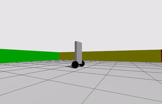

# twip - Two Wheeled Inverted Pendulum


## Introduction

This is an attempt at implementing a PID controller for a Two Wheeled Inverted Pendulum (a.k.a. Segway) mobile robot. Traditional approaches to this problem have relied on control engineering approaches of modeling the robot (i.e. the plant) and then designing the feedback controller using pole-zero analysis [Ogata2010](https://www.pearson.com/en-us/subject-catalog/p/modern-control-engineering/P200000003521/9780137551064). 

With the availability of environments like Gazebo Sim, solving the PID gain parameters by simulating the robot with a range of parameters becomes a simple approach to solving a complicated problem.

## Building

### Install prerequisites

Add keyrings for Gazebo

```
sudo apt-get update && sudo apt-get install cmake lsb-release wget gnupg 

sudo wget https://packages.osrfoundation.org/gazebo.gpg -O /usr/share/keyrings/pkgs-osrf-archive-keyring.gpg && echo "deb [arch=$(dpkg --print-architecture) signed-by=/usr/share/keyrings/pkgs-osrf-archive-keyring.gpg] http://packages.osrfoundation.org/gazebo/ubuntu-stable $(lsb_release -cs) main" | sudo tee /etc/apt/sources.list.d/gazebo-stable.list > /dev/null 
```

Run install

```
sudo apt-get install cmake sqlite3 libgz-msgs9-dev libgz-transport12-dev liblog4cpp5-dev
```


### Build

[](https://github.com/devonho/twip/actions/workflows/cmake.yml)

```
git clone https://github.com/devonho/twip.git
cd twip
mkdir build
cd build
cmake ../
```

## Running 


### Start Gazebo
```
cd ./twip/gz
gz sim world.sdf -r
```
Add `Key Publisher` via the plugin menu.

### Start controller  
```
./twip/build/src/controller
```

## References

Ogata2010 - Ogata K. Modern control engineering. Upper Saddle River, NJ: Prentice hall; 2010 Jan.


